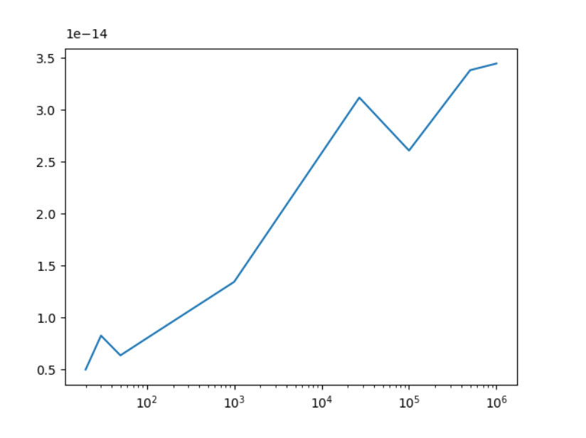

Быстрое преобразование Фурье.  

Вход: вектор X  
Выход: вектор Y, полученный применением к X прямого и обратного преобразования Фурье.  

Бесконечная норма разности входного и выходного векторов в зависимости от их длины:  

